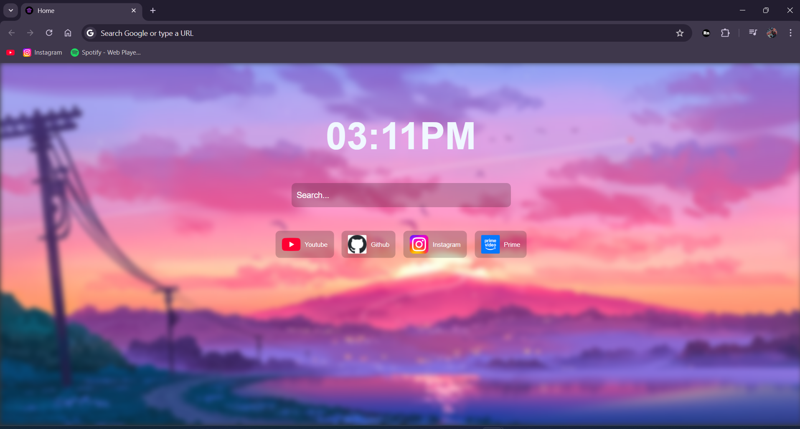

# Radon
Radon is a chrome extension that lets you customize the new tab page. You can use CSS to write code to customize it!

FEATURES:
- Custom CSS
- Keybindings to open websites
- Wallpapers
- Shortcuts
- A search Bar
- A clock
## Example


## How to use
Below is an example code involving the main classes and id.
```
body {
    margin: 0;
    padding: 0;
    font-family: Arial, sans-serif; /* Select a font*/
    color: white;
}

.custom-tab {
    display: flex;
    flex-direction: column;
    height: 100vh;
    justify-content: flex-start;
    align-items: center;
    background-color: rgba(0, 0, 0, 0.8);
    position: relative;
}

.wallpaper {
    position: absolute;
    top: 0;
    left: 0;
    right: 0;
    bottom: 0;
    background-size: cover;
    background-position: center;
    filter: blur(5px); /*adjust blur*/
    opacity: 1; /*adjust opacity of wallpaper*/
}

.shortcuts { 
    position: absolute;
    top: 50%;
    left: 50%;
    transform: translate(-50%, -50%);
    display: flex;
    gap: 15px;
    z-index: 1;
    flex-wrap: wrap;

}

.shortcut {
    display: flex;
    align-items: center;
    padding: 8px 12px;
    background-color: rgba(0, 0, 0, 0.2);
    border-radius: 8px;
    cursor: pointer;
    transition: background 0.3s ease-in-out;

}

.shortcut:hover {
    background-color: rgba(0, 0, 0, 0.4);
}

.shortcut img {
    width: 36px;
    height: 36px;
    margin-right: 8px;
    border-radius: 3px;
}

#clock
{
    font-size: 6em;
    margin-top: 100px;
    font-weight: 700;
    color: aliceblue;
    z-index: 1;
}


#search_bar 
{
    z-index: 1;
}

/*The actual search bar*/
#search_bar input
{
    background-color: rgba(0, 0, 0, 0.2);
    color: white;
    border: none;
    padding: 10px 10px;
    margin: 0 20px;
    outline: none;
    transition: background 0.3s ease-in-out;
    border-radius: 8px;
    height: 26px;
    font-size: 1.3em;
    
    width: 400px; /*Adjust search bar width*/
}

/*Color of search bar placeholder*/
::-webkit-input-placeholder {
    color:    rgb(255, 255, 255);
}
```
